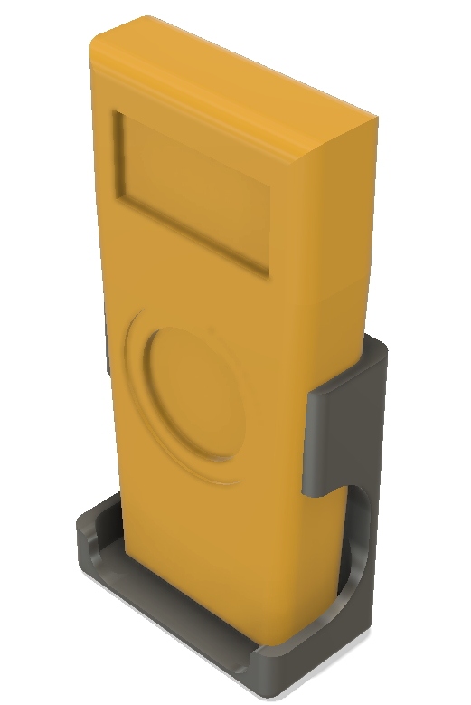

 
 
 

* [tasks](tasks.md)

# lab-4040

Electronics workbench made with aluminium profile item-8

## May 2020

----

<!-- pagebreak -->
## Feb 2022

----

<!-- pagebreak -->
## 01 Apr 2022
New white silicon mats

----

<!-- pagebreak -->
## 04 Apr 2022
No storage on bench, boards moved to #118 box

----

<!-- pagebreak -->
## 10 Oct 2022
* TEK Oscilloscope not blocked by DSLR camera
* Microscope and its monitor are accessible
* White monitor now deicated to DSLR
* New Monitorabove the DSLR monitor
* 2nd Oscilloscope and PSUs are accessible
* New Multimeter stand is movable
* Tools on scateboard
* Small tool holder near soldering iron

----

----
HP Oscilloscope and PSUs are accessible

----

Microscope is accessible

----

TEK oscilloscope is accessible

----

New Multimeter stand is movable

----

Small tool holder near soldering iron

----

Soldering/scoping position

----

New Function generator

----

Second HP 100 MHz oscilloscope 

----

Night lab

----

