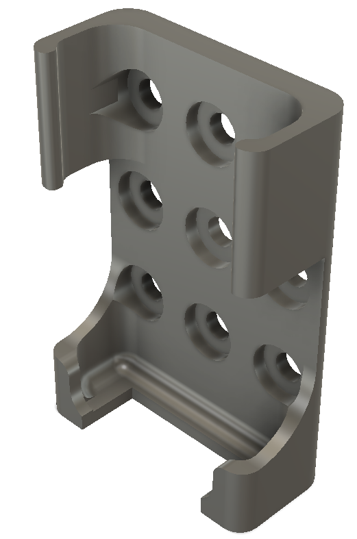

 
 
 

* [tasks](tasks.md)

# multimeterStand

Multimeter stand for aluminium profile item-8.

## Complete assembly
* Fluke 77
* Fluke 8060A
* Aluminium profiles 40x40mm
    - 2x 120mm
    - 1x 200mm
* Scateboard wheels 51mm
* 4x Probe holders
* Cables

## 3D model
fluke_bracket_1: Parametric design for standard sized multimeters
* Fluke 77
* Fluke 26
* Fluke 8060A
* Volcraft LCR meter 4073

----
fluke_bracket_2 for small sized Fluke 101

----

* Parametric design

----

<!-- pagebreak -->
## Assembly modeling with fluke 77 and fluke 25 ΙΙΙ  

----

## Assembly modeling with fluke 77 and fluke 101  

----

## 3D printing

----

## Assembly

----

## Fluke 101 3D model

----

## probeHolder

----

## item4040_120mm cad

----

## item4040_200mm cad

----

