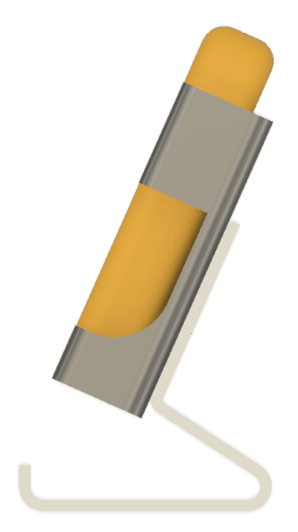
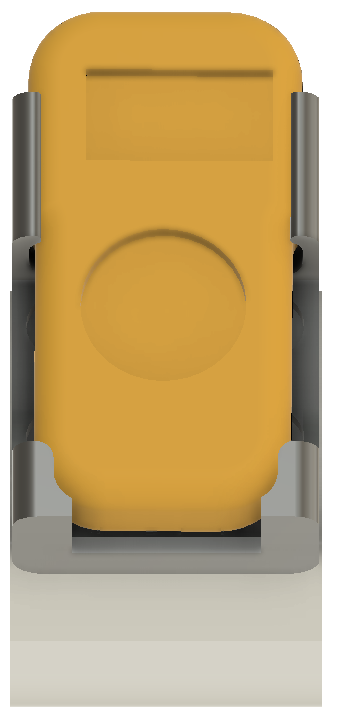
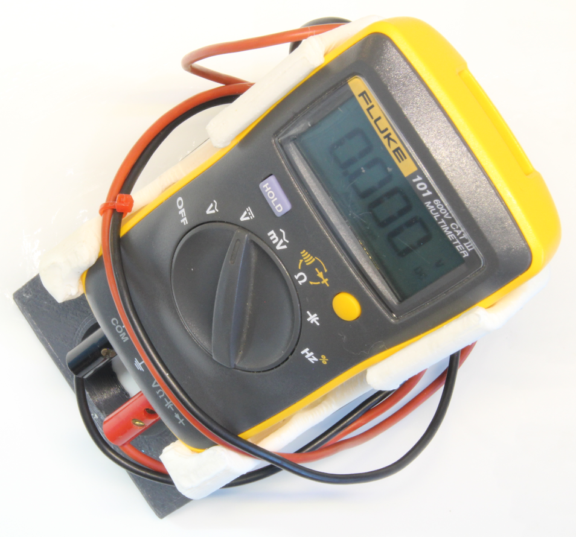
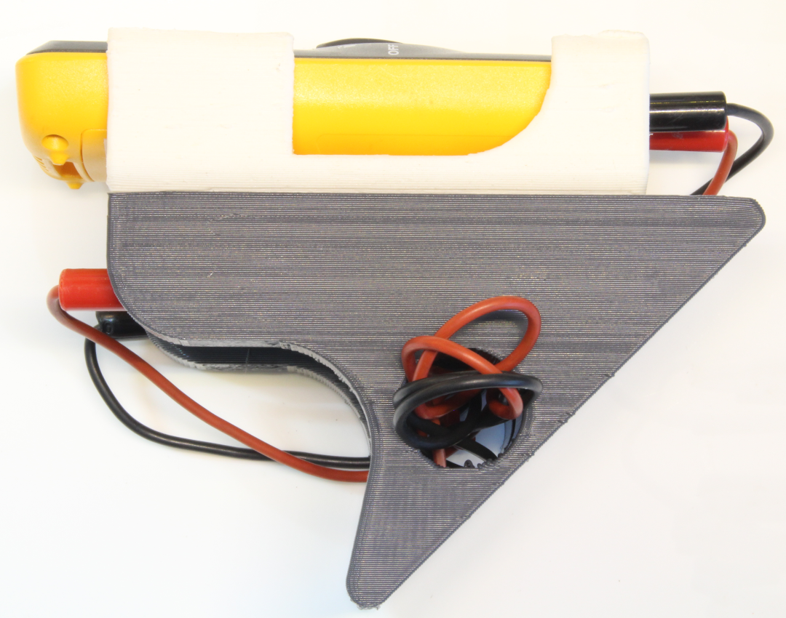
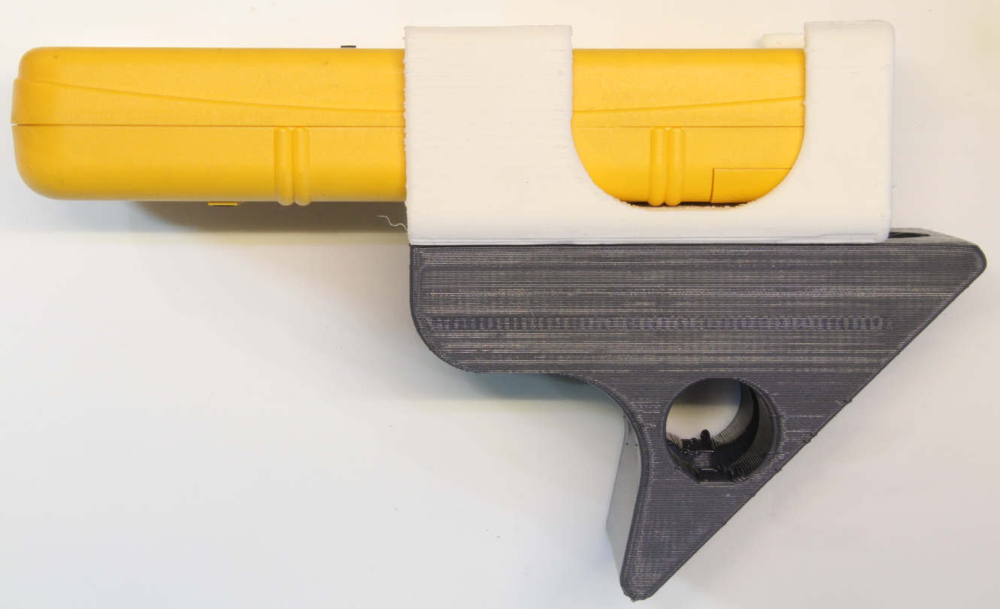
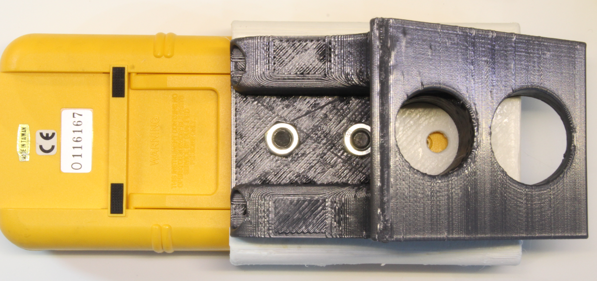
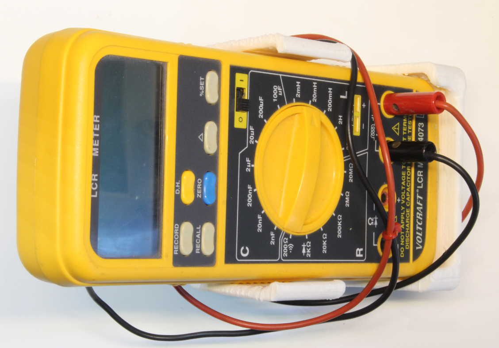
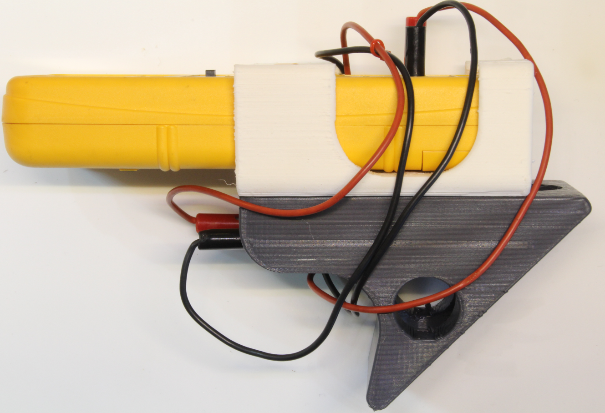
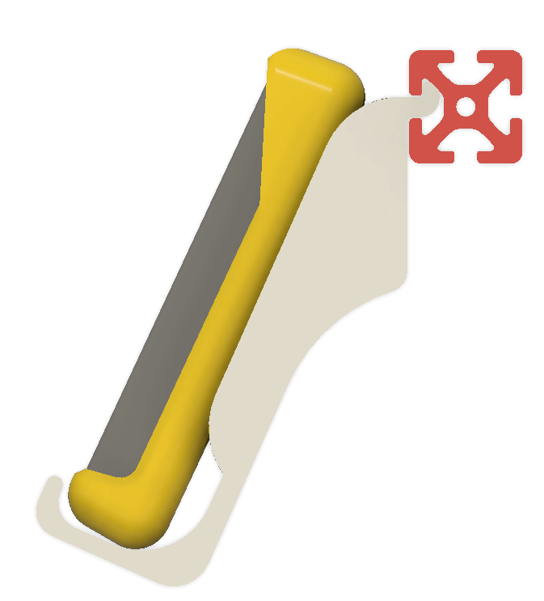
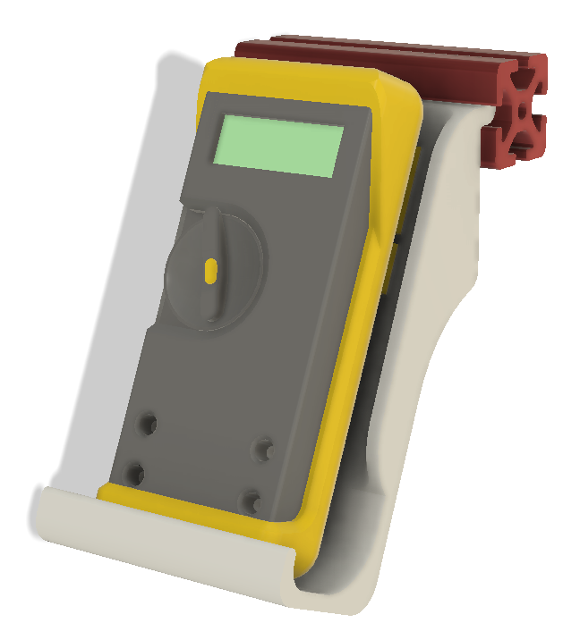

 
 
 

* [tasks](tasks.md)

# multimeterStand

Multimeter stand for 40x40 mm aluminium profile item-8.

## Complete assembly
* Fluke 77
* Fluke 8060A
* Aluminium profiles 40x40mm
    - 2x 120mm
    - 1x 200mm
* Scateboard wheels 51mm
* 4x Probe holders
* Cables

----

`image 10: fully assembled stand with aluminium profile and scatboard wheels`

----

## 3D model
fluke_bracket_1: Parametric design for standard sized multimeters
* Fluke 77
* Fluke 26
* Fluke 8060A
* Volcraft LCR meter 4073

----

`image 1: fluke_bracket_1: 3D model`

----
`image 16: fluke_bracket_2 for small sized Fluke 101`

----

`image 9: fusion360 Parametric design parameters list`

----

<!-- pagebreak -->
## Assembly modeling with fluke 77 and fluke 25 ΙΙΙ  

----

`image 15: Assembly modeling with aluminium profiles and scateboard wheels`

----

## Assembly modeling with fluke 77 and fluke 101 

----

`image 02: Assembly modeling with aluminium profiles and scateboard wheels, with Fluke101`

----

## 3D printing

----

## Assembly Fluke 77 & Fluke 266 iii

----

## Fluke 101 3D model

----

`image 11: Fluke 101 Fusion260 rough 3D model`

----

## Assembly Fluke 101

----

`images 18,19,20: Bracket assembled with Fluke-101`

----

## probeHolder

----

`image 12:Multimeter probe holder`

----

## item4040_120mm cad

----

## item4040_200mm cad

----

## multimeterTiltBracketFluke101

side view

----

back view with mounting holes

----

front view with Fluke-101

----
Slice with cura

----

Cura stats

----

###  multimeterTiltBracketFluke101 printout

----
side view

----
 front view

----

top view

----

## Hand-Saw reworked first version Printout for fluke_bracket_2

To update the Fluke-101 V1 printout being similar to V2, had to **Hand Saw** a section

----

**Hand Saw** Reworked Printout Fluke-101 V1, top view

----

**Hand Saw** Reworked Printout Fluke-101 V1 with multimeter, bottom view

----

**Hand Saw** 
----

`image 28: Reworked Printout Fluke-101 V1 with multimeter, top view`

----

## multimeterTiltBracketFluke101-2
2nd version Fluke101 tilt backet

----

`image 33: multimeterTiltBracketFluke101-2 3D model`

----

multimeterTiltBracketFluke101-2 assembly
* Tilt is 45' 
* Pockets for securing the measuremnt probes
* Large Holes for reducing printing material

----

`image 35: multimeterTiltBracketFluke101-2 slicer`

----

multimeterTiltBracketFluke101-2 slicer stats

* 2 hours 52 minutes 150g 19.00m @infill 25%

----

`image 37: multimeterTiltBracketFluke101-2 assembled, side view`

----

`image 38: multimeterTiltBracketFluke101-2 assembled, top view`

----

`image 39: multimeterTiltBracketFluke101-2 assembled, probes/cables on stand`

----

`image 40: multimeterTiltBracketFluke101-2 assembled, probes/cables on stand alternative`

----

`image 41: multimeterTiltBracketFluke101-2 assembled, probes/cables on stand side view`

----

### multimeterTiltBracketFluke101-2 with LCR meter
----

`image 42: multimeterTiltBracketFluke101-2 with LCR meter, side view`

----

`image 43: multimeterTiltBracketFluke101-2 with LCR meter, back-side view`

----

`image 44: multimeterTiltBracketFluke101-2 with LCR meter, top side view`

----

`image 45: multimeterTiltBracketFluke101-2 with LCR meter, cables on stand`

----

`image 46: multimeter4040 stand for item profile-8 (40x40mm) side view`

----

`image 47: multimeter4040 stand for item profile-8 (40x40mm) perspective view`

----